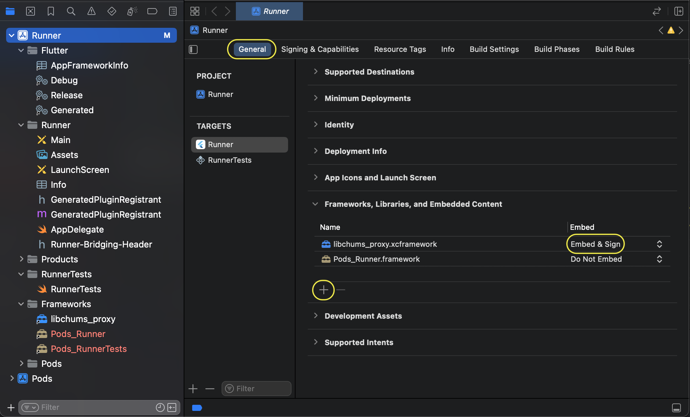

# chums_proxy

Flutter plugin for interacting with the native library of the chums proxy service.
The proxy launch on port 3000 at 127.0.0.1 

## Installing

At the moment, the plugin supports Android and iOS platforms.

### For Android,

it is enough to add a plugin depending on the main application `pubspec.yaml`.

### For iOS,

in addition to adding a plugin depending on the main application,
you need to connect XCFramework with the library on XCode project

The XC Framework is located in `./chums_proxy_ios/ios/Frameworks/libevernameproxy.xcframework`
You need to copy the folder "libevernameproxy.xcframework"
in the main application to the `/ios/Frameworks` directory

The structure of your application may look like this:

You can connect the framework to xcode as follows:

* Go to the "Frameworks, Libraries, and Embedded Content" section, click "+" and select the framework (find it in the navigator) that was previously added to your project in the ios/Frameworks directory. 
* Check that the Embed value is set in "Embed & Sign"
* In the "Build Phases" section, check that the "Embed frameworks" block is located above the "Thin Binary" block and contains the added libevernameproxy.xcframework 
* In the "Build Phases" section, in the "Link Binary With Libraries" block, the "Status" value for libevernameproxy.xcframework set to "Optional" 

### Application usage example:

<pre>
void main() {
  WidgetsFlutterBinding.ensureInitialized();
  ChumsProxyLifecycle().start();
  runApp(const ProxyApp());
}
</pre>
